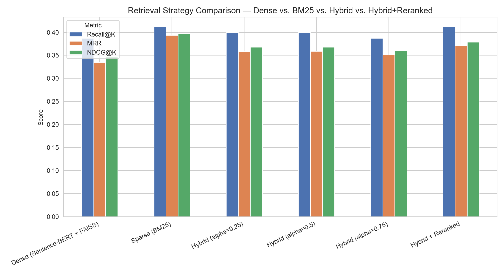
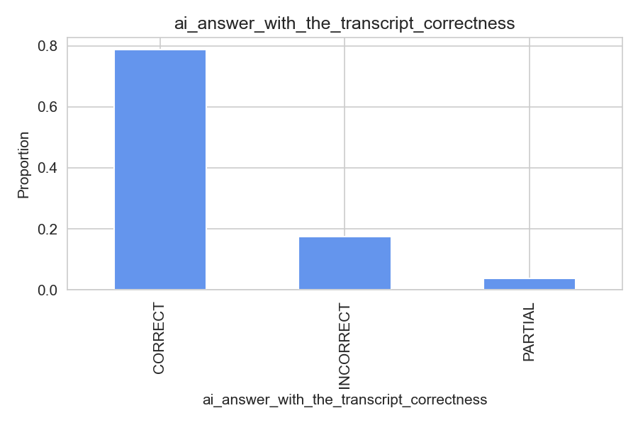
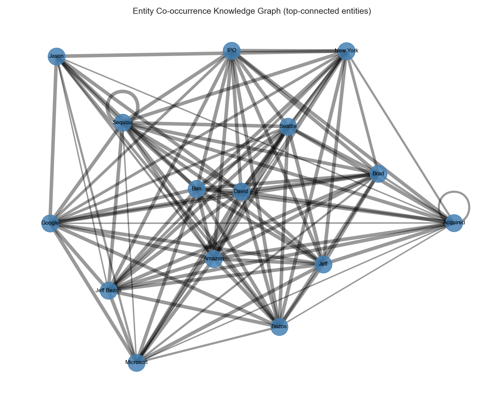
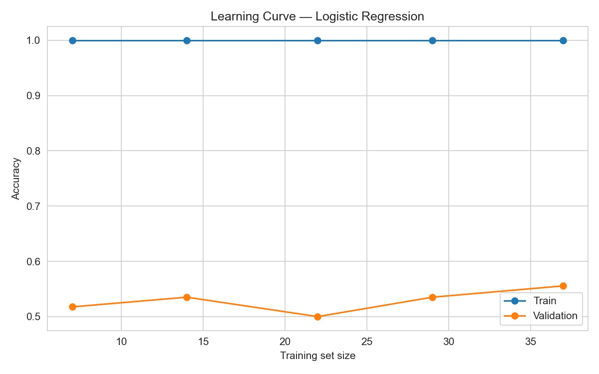

# RAG Evaluation Pipeline


An end-to-end **Retrieval-Augmented Generation (RAG) evaluation framework** built over the *Acquired* podcast archive.

This project explores a fundamental question:

> Does adding retrieval grounding actually improve LLM answer quality?

Instead of assuming that more advanced retrieval architectures perform better, this project benchmarks multiple retrieval strategies — **BM25, dense embeddings, hybrid search, and cross-encoder reranking** — and evaluates their impact using retrieval metrics, generation metrics, and human-annotated correctness labels.

---

# Project Overview

Large Language Models contain broad world knowledge, but they can hallucinate or provide outdated answers when they lack access to domain-specific information.

Retrieval-Augmented Generation solves this by:

1. Retrieving relevant documents from a knowledge base.
2. Providing those documents as context to an LLM.
3. Generating grounded answers based on retrieved evidence.

This project builds a complete RAG pipeline over business history conversations from the *Acquired* podcast and evaluates every major component:

- Document processing
- Chunking strategy
- Retrieval performance
- Reranking effectiveness
- Answer correctness
- Faithfulness
- Failure analysis

---

# Dataset

The project uses:

**Acquired Podcast Transcripts and RAG Evaluation Dataset**

Kaggle:
https://www.kaggle.com/datasets/harrywang/acquired-podcast-transcripts-and-rag-evaluation

The dataset contains:

- 200 Acquired podcast transcripts
- Approximately 3.5M words
- Metadata for each episode
- Human-generated question-answer evaluation pairs
- Human correctness labels for AI answers with and without transcript grounding

Dataset source:
https://www.kaggle.com/datasets/harrywang/acquired-podcast-transcripts-and-rag-evaluation

The QA evaluation data includes:

- Question
- Human answer
- AI answer without transcript context
- AI answer with transcript context
- Human correctness evaluation
- Answer quality ratings

---

# System Architecture

```
                    Podcast Transcripts
                            |
                            |
                    Text Processing
                            |
                 Sliding Window Chunking
                            |
        -----------------------------------------
        |                                       |
 Dense Retrieval                         Sparse Retrieval
 Sentence-BERT + FAISS                         BM25
        |                                       |
        -----------------------------------------
                            |
                     Hybrid Retrieval
                            |
                 Cross Encoder Reranking
                            |
                     Retrieved Context
                            |
                            |
                         LLM Answer
                            |
                            |
                Evaluation + Verification
```

---

# Pipeline Components

## 1. Data Processing

- Transcript cleaning
- Metadata extraction
- Sliding-window chunking
- Chunk overlap optimization

Configuration:

```
Chunk size: 800 words
Overlap: 100 words
```

---

# 2. Retrieval Systems Evaluated

## Dense Retrieval

Model:

- Sentence-BERT embeddings
- FAISS vector search

Strength:

- Semantic similarity
- Paraphrase matching


---

## Sparse Retrieval

Algorithm:

- BM25

Strength:

- Exact entity matching
- Numbers
- Dates
- Named entities


---

## Hybrid Retrieval

Combines:

- Dense similarity
- BM25 lexical matching

Different fusion weights were tested:

```
α = 0.25
α = 0.50
α = 0.75
```

---

## Cross Encoder Reranking

A cross encoder was applied after retrieval to improve ranking quality.

---

# Evaluation Metrics

## Retrieval Metrics

### Recall@K

Measures how many relevant documents appear in the top K retrieved results.

---

### MRR (Mean Reciprocal Rank)

Measures how early the first relevant result appears.

---

### NDCG@K

Measures ranking quality while giving more importance to highly ranked relevant documents.

---

# Retrieval Results

## Retrieval Benchmark




| Strategy | Recall@K | MRR | NDCG@K |
|---|---:|---:|---:|
| Dense (Sentence-BERT + FAISS) | 0.388 | 0.335 | 0.347 |
| Hybrid α=0.5 | 0.400 | 0.359 | 0.368 |
| Hybrid + Cross Encoder | 0.413 | 0.371 | 0.379 |
| **BM25** | **0.413** | **0.394** | **0.397** |


## Key Finding

The expected result was:

```
Dense + Hybrid + Reranking > BM25
```

The actual result:

```
BM25 > Hybrid > Dense
```

on this evaluation dataset.

The query distribution was dominated by:

- Companies
- Founders
- IPO dates
- Revenue numbers
- Market events

These are exactly the cases where lexical retrieval performs strongly.

The lesson:

> Always benchmark retrieval approaches on your own query distribution.

---

# RAG Grounding Evaluation

## Does Retrieval Improve Correctness?




Evaluation set:

```
80 human-graded questions
```

| Condition | Correct Answers | Correct Rate |
|---|---:|---:|
| Without Transcript | 33/80 | 41.25% |
| With Transcript | 63/80 | 78.75% |


Retrieval grounding produced:

```
+37.5 percentage point improvement
```

Relative improvement:

```
+90.9%
```

---

# Generation Evaluation

Metrics:

- BLEU
- ROUGE
- Semantic Similarity
- BERTScore
- RAGAS-style metrics


## Important Evaluation Discovery

Reference answers were very short:

```
Median human answer length:
~5-6 words
```

Generated answers:

```
Median AI answer length:
40-60 words
```

This caused BLEU and ROUGE scores to underestimate quality because correct answers were often paraphrases.

---

# Knowledge Graph

Named entity extraction was performed using spaCy.




Extracted entities:

| Entity | Count |
|---|---:|
| PERSON | 6,993 |
| ORGANIZATION | 3,614 |
| LOCATION | 892 |
| MONEY | 580 |
| PRODUCT | 150 |
| Total | 12,229 |

The graph highlights major entities:

- Amazon
- AWS
- Airbnb
- Google
- Microsoft
- Bezos
- IPOs

---

# Machine Learning Experiments

The project also explored predicting answer correctness using supervised models.

Models tested:

- Logistic Regression
- Naive Bayes
- Random Forest
- Gradient Boosting
- CatBoost
- XGBoost
- LSTM
- BiLSTM
- GRU


## Main Finding

With only ~70 labeled examples:

- Classical models overfit
- Deep learning models collapsed toward majority-class prediction
- Feature importance became unstable
- SHAP explanations became meaningless


Example:



---

# Failure Analysis

One of the biggest lessons came from a pipeline bug.

The generator model failed to load, causing the system to return retrieved context directly instead of generated answers.

The evaluation metrics looked surprisingly good because the system was comparing context against itself.

Lesson:

> A metric with zero variance is often a debugging signal, not a success signal.

Always inspect:

- Raw outputs
- Retrieval results
- Generated answers
- Evaluation distributions

before trusting aggregate metrics.

---

# Repository Structure

```
rag-evaluation-pipeline/

│
├── data/
│
├── outputs/
│   └── figures/
│       ├── retrieval_comparison.png
│       ├── knowledge_graph.png
│       ├── learning_curve.png
│       └── ...
│
└── README.md
```

---

# Installation

Clone repository:

```bash
git clone https://github.com/Y-R-A-V-R-5/rag-evaluation-pipeline.git

cd rag-evaluation-pipeline
```

Install dependencies:

```bash
pip install -r requirements.txt
```

---

# Future Improvements

Potential extensions:

- Larger human evaluation dataset
- Query classification before retrieval
- Learned retrieval routing
- Better numerical reasoning retrieval
- Agent-based retrieval planning
- Production deployment with monitoring
- Automated RAG evaluation framework

---

# Key Takeaways

1. Retrieval quality depends on the dataset.

2. BM25 remains a strong baseline.

3. More complex architectures do not guarantee better performance.

4. Evaluation design matters as much as model selection.

5. Debugging raw outputs is essential before trusting metrics.

---

# Author

Built by **Y-R-A-V-R-5**

GitHub:
https://github.com/Y-R-A-V-R-5

---

# Acknowledgements

Dataset:

Acquired Podcast Transcripts and RAG Evaluation Dataset  
Created by Harry Wang and contributors.

The dataset enabled evaluation of retrieval grounding using human-annotated QA pairs. :contentReference[oaicite:1]{index=1}

---

# License

MIT License
